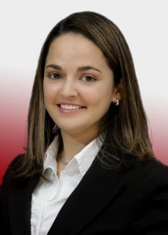

I grew up in a small town called **Nicoya**, located in the province of **Guanacaste, Costa Rica**. My house was (and still is) in the middle of my grandparents’ farm, surrounded by cows and horses. I was so much into soccer, that my dad helped us build a soccer “field” next to our house (yes, right in the middle of the farm too). The goal posts were made out of pieces of wood from fallen trees, and sometimes we even had to stop games because the cows were blocking the goals or they were in the middle of our “field”.

Not everyone in our town owned a computer and technology access was limited. At the age of 8, my parents signed me up for a computer course that took place at the public high school, Liceo de Nicoya. I learned to program with the famous **LOGO** turtle. I remember I was always excited to go to computer class to give commands to **LOGO**, the turtle, and print my creations. I did not know back then as much as I know now, that programming was going to be a key turning point in my life.

I finished high school in 2004 at Colegio Santa Ana, located in Liberia about 1 hour away from my hometown. In 2005, I attended the University of Costa Rica for a year and I was recruited to play for [Saprissa Women’s Soccer][Saprissa] team. We won our Division II championship and went on to compete in Division I. It was an exciting year. My regional team, Nicoya, also qualified to compete for the National Games in early 2006. That same year, I decided to travel abroad. A few days after National Games, I left Costa Rica to come to the United States.

I participated in the [Cultural Care Au Pair Program][AuPair] for 2 years. Lived in Portland, OR for a year and then in Maplewood, NJ the next year. It was a great opportunity were I was able to experience both, the West and the East coast in the US.

After being an Au Pair, I decided to stay and attend school here in the US. I started at [SUNY Rockland Community College][SUNY] and graduated with an A.S in Computer Information Systems (GPA 3.83). Attending a community college opened many doors for me, which led to academic and athletic scholarship opportunities to complete my 4-year degree at [St. Thomas Aquinas College][STAC] with a B.S. in Computer Science (GPA 3.56). Later on, I received a Merit scholarship to attend Graduate school. Thanks to that, in December of 2014 I completed my Masters in Computer Science (GPA 3.81) at [Pace University][PACE].

I currently work as a Web Developer at [On-Net Surveillance Systems, Inc. (OnSSI)][OnSSI]. I am also an Adjunct of Computer Studies at [Rockland Community College][SUNY] and an Adjunct of Computer Science at [St. Thomas Aquinas College][STAC].

When not at work, you can find me at the gym or home reading a book with my dog and cats! Thank you for stopping by. Please visit my blog and let me know what you think!

[Saprissa]: 	http://www.saprissa.cr/
[AuPair]:		https://culturalcare.com/
[OnSSI]:		https://onssi.com
[SUNY]:			http://www.sunyrockland.edu/
[STAC]:			http://www.stac.edu/
[PACE]:			http://www.pace.edu/
